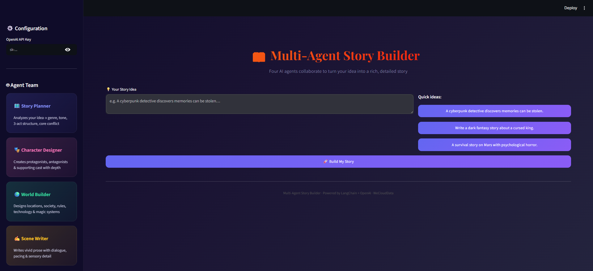

# 🤖 Multi-Agent Creative Story Building System

<p align="center">
  
</p>

An advanced orchestration-driven Multi-Agent Generative AI system that transforms a single story idea into a rich, structured, and coherent narrative through collaboration between specialized AI agents.

Built using **LangChain**, **LangGraph**, **OpenAI**, and **Streamlit**, the system demonstrates how multiple AI agents can coordinate, share memory, and iteratively refine creative content while maintaining narrative consistency.

---

## 🌟 Features

### 🧠 Multi-Agent Collaboration

Four specialized AI agents work together:

- 📖 Story Planner
- 🎭 Character Designer
- 🌍 World Builder
- ✍️ Scene Writer

Each agent focuses on a specific storytelling responsibility to improve quality and reduce overlap.

### 🔄 Structured Story Generation

The system converts a simple idea into:

- Story outline
- Character profiles
- World-building details
- Complete narrative scenes

### 🗂 Shared Story Memory

Agents share context through a centralized memory layer, allowing:

- Consistent character behavior
- Persistent world rules
- Reduced plot contradictions
- Improved long-form storytelling

### 🎯 Role-Based Agent Design

Every agent operates within strict boundaries:

| Agent | Responsibility |
|---------|---------------|
| Story Planner | Plot structure & story flow |
| Character Designer | Character creation & relationships |
| World Builder | Environment, rules & lore |
| Scene Writer | Narrative generation & storytelling |

---

## 🏗️ System Workflow

The story generation pipeline follows these steps:

1. User provides a story premise.
2. Story Planner creates the narrative structure.
3. Character Designer generates key characters.
4. World Builder develops the setting and lore.
5. Scene Writer produces the final story.
6. Shared memory maintains consistency across all stages.

---

## 🖥️ User Interface

The application provides an interactive Streamlit dashboard where users can:

- Enter a story idea
- Configure OpenAI API access
- Generate complete stories
- Explore agent-generated outputs

---

## 🚀 Tech Stack

- Python
- LangChain
- LangGraph
- OpenAI API
- Streamlit

---

## 📸 Demo

The interface below demonstrates the Multi-Agent Story Builder in action.


---

## 🎯 Example Prompt

```text
A cyberpunk detective discovers memories can be stolen.
```

The system automatically generates:

- Story structure
- Character profiles
- World design
- Complete story scenes

---

## 👩‍💻 Authors

- Majid Alshehri
- Maysam Abduljalil
- Ruba alfahidah

AI Developer | Multi-Agent Systems | Generative AI | Software Engineering